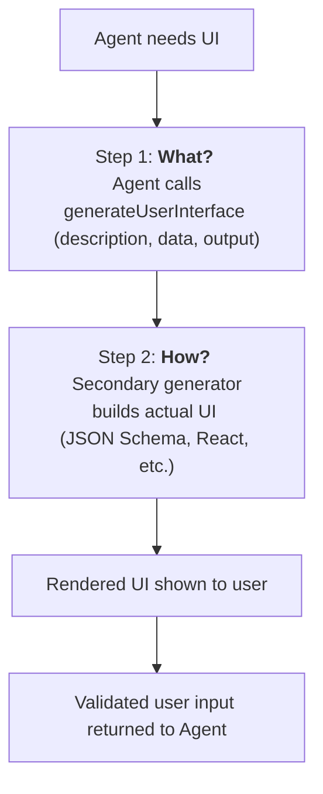

# Generative User Interfaces

## Summary

### Problem Statement

Currently, creating custom user interfaces for agent interactions requires
programmers to define specific tool renderers. This limits the flexibility and
adaptability of agent-driven applications.

### Motivation

This draft describes an AG-UI extension that addresses **generative user
interfaces**—interfaces produced directly by artificial intelligence without
requiring a programmer to define custom tool renderers. The key idea is to
leverage our ability to send client-side tools to the agent, thereby enabling
this capability across all agent frameworks supported by AG-UI.

## Status

- **Status**: Draft
- **Author(s)**: Markus Ecker (mail@mme.xyz)

## Challenges and Limitations

### Tool Description Length

OpenAI enforces a limit of 1024 characters for tool descriptions. Gemini and
Anthropic impose no such limit.

### Arguments JSON Schema Constraints

Classes, nesting, `$ref`, and `oneOf` are not reliably supported across LLM
providers.

### Context Window Considerations

Injecting a large UI description language into an agent may reduce its
performance. Agents dedicated solely to UI generation perform better than agents
combining UI generation with other tasks.

## Detailed Specification

### Two-Step Generation Process



### Step 1: What to Generate?

Inject a lightweight tool into the agent:

**Tool Definition:**

- **Name:** `generateUserInterface`
- **Arguments:**
  - **description**: A high-level description of the UI (e.g., _"A form for
    entering the user's address"_)
  - **data**: Arbitrary pre-populated data for the generated UI
  - **output**: A description or schema of the data the agent expects the user
    to submit back (fields, required/optional, types, constraints)

**Example Tool Call:**

```json
{
  "tool": "generateUserInterface",
  "arguments": {
    "description": "A form that collects a user's shipping address.",
    "data": {
      "firstName": "Ada",
      "lastName": "Lovelace",
      "city": "London"
    },
    "output": {
      "type": "object",
      "required": [
        "firstName",
        "lastName",
        "street",
        "city",
        "postalCode",
        "country"
      ],
      "properties": {
        "firstName": { "type": "string", "title": "First Name" },
        "lastName": { "type": "string", "title": "Last Name" },
        "street": { "type": "string", "title": "Street Address" },
        "city": { "type": "string", "title": "City" },
        "postalCode": { "type": "string", "title": "Postal Code" },
        "country": {
          "type": "string",
          "title": "Country",
          "enum": ["GB", "US", "DE", "AT"]
        }
      }
    }
  }
}
```

### Step 2: How to Generate?

Delegate UI generation to a secondary LLM or agent:

- The CopilotKit user stays in control: Can make their own generators, add
  custom libraries, include additional prompts etc.
- On tool invocation, the secondary model consumes `description`, `data`, and
  `output` to generate the user interface
- This model is focused solely on UI generation, ensuring maximum fidelity and
  consistency
- The generation method can be swapped as needed (e.g., JSON, HTML, or other
  renderable formats)
- The UI format description is not subject to structural or length constraints,
  allowing arbitrarily complex specifications

## Implementation Examples

### Example Output: UISchemaGenerator

```json
{
  "jsonSchema": {
    "title": "Shipping Address",
    "type": "object",
    "required": [
      "firstName",
      "lastName",
      "street",
      "city",
      "postalCode",
      "country"
    ],
    "properties": {
      "firstName": { "type": "string", "title": "First name" },
      "lastName": { "type": "string", "title": "Last name" },
      "street": { "type": "string", "title": "Street address" },
      "city": { "type": "string", "title": "City" },
      "postalCode": { "type": "string", "title": "Postal code" },
      "country": {
        "type": "string",
        "title": "Country",
        "enum": ["GB", "US", "DE", "AT"]
      }
    }
  },
  "uiSchema": {
    "type": "VerticalLayout",
    "elements": [
      {
        "type": "Group",
        "label": "Personal Information",
        "elements": [
          { "type": "Control", "scope": "#/properties/firstName" },
          { "type": "Control", "scope": "#/properties/lastName" }
        ]
      },
      {
        "type": "Group",
        "label": "Address",
        "elements": [
          { "type": "Control", "scope": "#/properties/street" },
          { "type": "Control", "scope": "#/properties/city" },
          { "type": "Control", "scope": "#/properties/postalCode" },
          { "type": "Control", "scope": "#/properties/country" }
        ]
      }
    ]
  },
  "initialData": {
    "firstName": "Ada",
    "lastName": "Lovelace",
    "city": "London",
    "country": "GB"
  }
}
```

### Example Output: ReactFormHookGenerator

```tsx
import React from "react"
import { useForm } from "react-hook-form"
import { z } from "zod"
import { zodResolver } from "@hookform/resolvers/zod"

// ----- Schema (contract) -----
const AddressSchema = z.object({
  firstName: z.string().min(1, "Required"),
  lastName: z.string().min(1, "Required"),
  street: z.string().min(1, "Required"),
  city: z.string().min(1, "Required"),
  postalCode: z.string().regex(/^[A-Za-z0-9\\-\\s]{3,10}$/, "3–10 chars"),
  country: z.enum(["GB", "US", "DE", "AT", "FR", "IT", "ES"]),
})
export type Address = z.infer<typeof AddressSchema>

type Props = {
  initialData?: Partial<Address>
  meta?: { title?: string; submitLabel?: string }
  respond: (data: Address) => void // <-- called on successful submit
}

const COUNTRIES: Address["country"][] = [
  "GB",
  "US",
  "DE",
  "AT",
  "FR",
  "IT",
  "ES",
]

export default function AddressForm({ initialData, meta, respond }: Props) {
  const {
    register,
    handleSubmit,
    formState: { errors },
  } = useForm<Address>({
    resolver: zodResolver(AddressSchema),
    defaultValues: {
      firstName: "",
      lastName: "",
      street: "",
      city: "",
      postalCode: "",
      country: "GB",
      ...initialData,
    },
  })

  const onSubmit = (data: Address) => {
    // Guaranteed to match AddressSchema
    respond(data)
  }

  return (
    <form onSubmit={handleSubmit(onSubmit)}>
      {meta?.title && <h2>{meta.title}</h2>}

      {/* Section: Personal Information */}
      <fieldset>
        <legend>Personal Information</legend>

        <div>
          <label>First name</label>
          <input {...register("firstName")} placeholder="Ada" autoFocus />
          {errors.firstName && <small>{errors.firstName.message}</small>}
        </div>

        <div>
          <label>Last name</label>
          <input {...register("lastName")} placeholder="Lovelace" />
          {errors.lastName && <small>{errors.lastName.message}</small>}
        </div>
      </fieldset>

      {/* Section: Address */}
      <fieldset>
        <legend>Address</legend>

        <div>
          <label>Street address</label>
          <input {...register("street")} />
          {errors.street && <small>{errors.street.message}</small>}
        </div>

        <div>
          <label>City</label>
          <input {...register("city")} />
          {errors.city && <small>{errors.city.message}</small>}
        </div>

        <div>
          <label>Postal code</label>
          <input {...register("postalCode")} />
          {errors.postalCode && <small>{errors.postalCode.message}</small>}
        </div>

        <div>
          <label>Country</label>
          <select {...register("country")}>
            {COUNTRIES.map((c) => (
              <option key={c} value={c}>
                {c}
              </option>
            ))}
          </select>
          {errors.country && <small>{errors.country.message}</small>}
        </div>
      </fieldset>

      <div>
        <button type="submit">{meta?.submitLabel ?? "Submit"}</button>
      </div>
    </form>
  )
}
```

## Implementation Considerations

### Client SDK Changes

TypeScript SDK additions:

- New `generateUserInterface` tool type
- UI generator registry for pluggable generators
- Validation layer for generated UI schemas
- Response handler for user-submitted data

Python SDK additions:

- Support for UI generation tool invocation
- Schema validation utilities
- Serialization for UI definitions

### Integration Impact

- All AG-UI integrations can leverage this capability without modification
- Frameworks emit standard tool calls; client handles UI generation
- Backward compatible with existing tool-based UI approaches

## Use Cases

### Dynamic Forms

Agents can generate forms on-the-fly based on conversation context without
pre-defined schemas.

### Data Visualization

Generate charts, graphs, or tables appropriate to the data being discussed.

### Interactive Workflows

Create multi-step wizards or guided processes tailored to user needs.

### Adaptive Interfaces

Generate different UI layouts based on user preferences or device capabilities.

## Testing Strategy

- Unit tests for tool injection and invocation
- Integration tests with multiple UI generators
- E2E tests demonstrating various UI types
- Performance benchmarks comparing single vs. two-step generation
- Cross-provider compatibility testing

## References

- [AG-UI Tools Documentation](/concepts/tools)
- [JSON Schema](https://json-schema.org/)
- [React Hook Form](https://react-hook-form.com/)
- [JSON Forms](https://jsonforms.io/)
