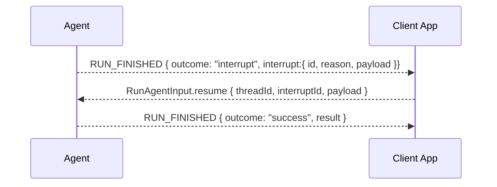

# Interrupt-Aware Run Lifecycle Proposal

## Summary

### Problem Statement

Agents often need to pause execution to request human approval, gather
additional input, or confirm potentially risky actions. Currently, there's no
standardized way to handle these interruptions across different agent
frameworks.

### Motivation

Support **human-in-the-loop pauses** (and related mechanisms) natively in AG-UI
and CopilotKit. This enables compatibility with various framework interrupts,
workflow suspend/resume, and other framework-specific pause mechanisms.

## Status

- **Status**: Draft
- **Author(s)**: Markus Ecker (mail@mme.xyz)

## Overview

This proposal introduces a standardized interrupt/resume pattern:



## Detailed Specification

### Updates to RUN_FINISHED Event

```typescript
type RunFinishedOutcome = "success" | "interrupt"

type RunFinished = {
  type: "RUN_FINISHED"

  // ... existing fields

  outcome?: RunFinishedOutcome // optional for back-compat (see rules below)

  // Present when outcome === "success" (or when outcome omitted and interrupt is absent)
  result?: any

  // Present when outcome === "interrupt" (or when outcome omitted and interrupt is present)
  interrupt?: {
    id?: string // id can be set when needed
    reason?: string // e.g. "human_approval" | "upload_required" | "policy_hold"
    payload?: any // arbitrary JSON for UI (forms, proposals, diffs, etc.)
  }
}
```

When a run finishes with `outcome == "interrupt"`, the agent indicates that on
the next run, a value needs to be provided to continue.

### Updates to RunAgentInput

```typescript
type RunAgentInput = {
  // ... existing fields

  // NEW: resume channel for continuing a suspension
  resume?: {
    interruptId?: string // echo back if one was provided
    payload?: any // arbitrary JSON: approvals, edits, files-as-refs, etc.
  }
}
```

### Contract Rules

- Resume requests **must** use the same `threadId`
- When given in the `interrupt`, the `interruptId` must be provided via
  `RunAgentInput`
- Agents should handle missing or invalid resume payloads gracefully

## Implementation Examples

### Minimal Interrupt/Resume

**Agent sends interrupt:**

```json
{
  "type": "RUN_FINISHED",
  "threadId": "t1",
  "runId": "r1",
  "outcome": "interrupt",
  "interrupt": {
    "id": "int-abc123",
    "reason": "human_approval",
    "payload": {
      "proposal": {
        "tool": "sendEmail",
        "args": { "to": "a@b.com", "subject": "Hi", "body": "…" }
      }
    }
  }
}
```

**User responds:**

```json
{
  "threadId": "t1",
  "runId": "r2",
  "resume": {
    "interruptId": "int-abc123",
    "payload": { "approved": true }
  }
}
```

### Complex Approval Flow

**Agent requests approval with context:**

```json
{
  "type": "RUN_FINISHED",
  "threadId": "thread-456",
  "runId": "run-789",
  "outcome": "interrupt",
  "interrupt": {
    "id": "approval-001",
    "reason": "database_modification",
    "payload": {
      "action": "DELETE",
      "table": "users",
      "affectedRows": 42,
      "query": "DELETE FROM users WHERE last_login < '2023-01-01'",
      "rollbackPlan": "Restore from backup snapshot-2025-01-23",
      "riskLevel": "high"
    }
  }
}
```

**User approves with modifications:**

```json
{
  "threadId": "thread-456",
  "runId": "run-790",
  "resume": {
    "interruptId": "approval-001",
    "payload": {
      "approved": true,
      "modifications": {
        "batchSize": 10,
        "dryRun": true
      }
    }
  }
}
```

## Use Cases

### Human Approval

Agents pause before executing sensitive operations (sending emails, making
purchases, deleting data).

### Information Gathering

Agent requests additional context or files from the user mid-execution.

### Policy Enforcement

Automatic pauses triggered by organizational policies or compliance
requirements.

### Multi-Step Wizards

Complex workflows where each step requires user confirmation or input.

### Error Recovery

Agent pauses when encountering an error, allowing user to provide guidance.

## Implementation Considerations

### Client SDK Changes

TypeScript SDK:

- Extended `RunFinishedEvent` type with outcome and interrupt fields
- Updated `RunAgentInput` with resume field
- Helper methods for interrupt handling

Python SDK:

- Extended `RunFinishedEvent` class
- Updated `RunAgentInput` with resume support
- Interrupt state management utilities

### Framework Integration

**Planning Frameworks:**

- Map framework interrupts to AG-UI interrupt events
- Handle resume payloads in execution continuation

**Workflow Systems:**

- Convert workflow suspensions to AG-UI interrupts
- Resume workflow execution with provided payload

**Custom Frameworks:**

- Provide interrupt/resume adapter interface
- Documentation for integration patterns

### UI Considerations

- Standard components for common interrupt reasons
- Customizable interrupt UI based on payload
- Clear indication of pending interrupts
- History of interrupt/resume actions

## Testing Strategy

- Unit tests for interrupt/resume serialization
- Integration tests with multiple frameworks
- E2E tests demonstrating various interrupt scenarios
- State consistency tests across interrupt boundaries
- Performance tests for rapid interrupt/resume cycles

## References

- [AG-UI Events Documentation](/concepts/events)
- [AG-UI State Management](/concepts/state)
