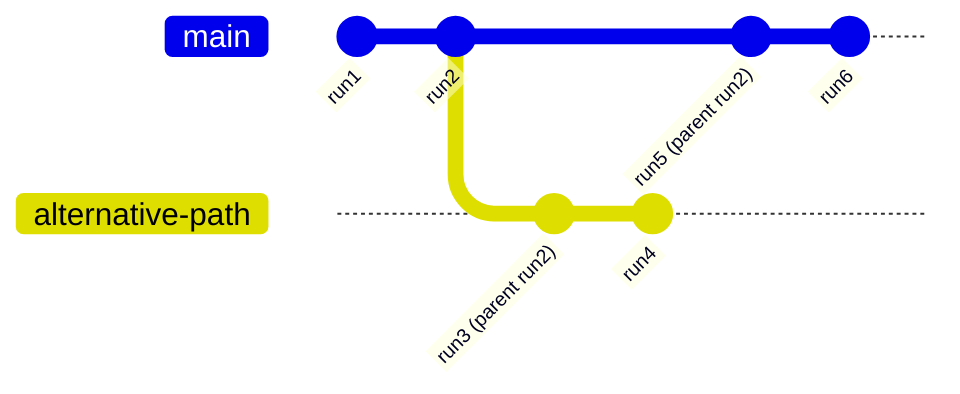

# Serialization Proposal

## Summary

### Problem Statement

Currently, there's no standardized way to serialize and restore AG-UI event
streams, making it difficult to reload chat history, attach to running agents,
or implement branching/time travel features.

### Motivation

AG-UI adds **stream serialization** to reload chat history and attach to active
agents, enabling restoration and interaction with live state. A standardized
`compactEvents(events: BaseEvent[]): BaseEvent[]` reduces already-streamed
events and normalizes inputs. Additionally, `RunStartedEvent` gains
`parentRunId` for branching/time travel and an `input` field carrying the exact
`AgentInput` sent to the agent (which may omit messages already present in
history).

## Status

- **Status**: Draft
- **Author(s)**: Markus Ecker (mail@mme.xyz)

## Detailed Specification

### Overview

This proposal introduces three key capabilities:

1. **Stream serialization** - Serialize/deserialize event streams for
   persistence and restoration
2. **Event compaction** - Reduce event volume while preserving semantic meaning
3. **Run lineage tracking** - Enable branching and time travel with parent run
   references

### Git-like Branching Model

The `parentRunId` field enables a git-like branching structure where the entire
conversation history can be stored as a continuous serialized stream, with each
run forming nodes in a directed acyclic graph:



**Key Benefits of This Append-Only Architecture:**

- **Immutable History**: Events are never modified or deleted, only appended
- **Serializable Stream**: The entire DAG can be stored as a single continuous
  stream of events
- **Multiple Branches**: Different conversation paths coexist in the same
  serialized log
- **Time Travel**: Navigate to any point in any branch without data loss
- **Efficient Storage**: Compaction reduces redundancy while preserving the full
  graph structure

## Proposed Changes

### Stream Serialization

Support serializing/deserializing the event stream so chat history can be
reloaded and sessions can attach to running agents/live state.

### Event Compaction

Introduce `compactEvents(events: BaseEvent[]): BaseEvent[]` to:

- Reduce the number of already-streamed events
- **Normalize** `RunStartedEvent.input` so it contains only the messages that
  were not already sent/recorded earlier in the thread

```typescript
// Event compaction API
declare function compactEvents(events: BaseEvent[]): BaseEvent[]
```

### Run Lineage and Input Capture

Extend `RunStartedEvent` with:

- `parentRunId?: string` to enable branching/time travel - similar to git
  commits, this creates an append-only log where each run points to its parent,
  forming a directed acyclic graph of conversation branches
- `input?: AgentInput` containing the agent input exactly as sent
  - `input.messages` **may omit** messages already present in history
  - `compactEvents` **normalizes** this field to a minimal form

## Updated Types

```typescript
type RunStartedEvent = BaseEvent & {
  type: EventType.RUN_STARTED
  threadId: string
  runId: string
  /**
   * Optional lineage pointer for branching/time travel.
   * If present, refers to a prior run within the same thread.
   * Creates a git-like append-only log where runs form a DAG (directed acyclic graph),
   * enabling conversation branching without mutating existing history.
   */
  parentRunId?: string
  /**
   * The exact AgentInput payload that was sent to the agent for this run.
   * May omit messages already present in history; compactEvents() will normalize.
   */
  input?: AgentInput
}
```

## Event Compaction Rules

The `compactEvents` function applies these transformations:

### Message Events

- Consecutive `TEXT_MESSAGE_CONTENT` events with same `messageId` → single event
  with concatenated content
- Complete message sequences (START + CONTENT + END) → single snapshot event
- Tool call sequences → compacted tool invocation records

### State Events

- Multiple `STATE_DELTA` events → single `STATE_SNAPSHOT` with final state
- Redundant state updates → removed if superseded by later snapshots

### Run Input Normalization

- Messages in `RunStartedEvent.input` that exist in prior events → removed
- Only new/incremental messages retained in normalized form

## Implementation Examples

### Basic Serialization

```typescript
// Serialize event stream
const events: BaseEvent[] = [...]; // Full event history
const serialized = JSON.stringify(events);

// Store to database, file, etc.
await storage.save(threadId, serialized);

// Later: deserialize and restore
const restored = JSON.parse(await storage.load(threadId));
const compacted = compactEvents(restored);
```

### Event Compaction Example

**Before compaction:**

```typescript
;[
  { type: "TEXT_MESSAGE_START", messageId: "msg1", role: "user" },
  { type: "TEXT_MESSAGE_CONTENT", messageId: "msg1", delta: "Hello " },
  { type: "TEXT_MESSAGE_CONTENT", messageId: "msg1", delta: "world" },
  { type: "TEXT_MESSAGE_END", messageId: "msg1" },
  { type: "STATE_DELTA", patch: { op: "add", path: "/foo", value: 1 } },
  { type: "STATE_DELTA", patch: { op: "replace", path: "/foo", value: 2 } },
]
```

**After compaction:**

```typescript
;[
  {
    type: "MESSAGES_SNAPSHOT",
    messages: [{ id: "msg1", role: "user", content: "Hello world" }],
  },
  {
    type: "STATE_SNAPSHOT",
    state: { foo: 2 },
  },
]
```

### Branching with Parent Run ID

The `parentRunId` field creates a git-like branching model where the event
stream becomes an immutable, append-only log. Each run can branch from any
previous run, creating alternative conversation paths without modifying the
original history.

```typescript
// Original run (like a git commit)
{
  type: "RUN_STARTED",
  threadId: "thread1",
  runId: "run1",
  input: { messages: ["Tell me about Paris"] }
}

// Branch from run1 (like creating a git branch from a specific commit)
{
  type: "RUN_STARTED",
  threadId: "thread1",
  runId: "run2",
  parentRunId: "run1",  // Points to parent, creating a new branch
  input: { messages: ["Actually, tell me about London instead"] }
}
```

This append-only structure ensures that:

- No existing events are ever modified or deleted
- Multiple branches can coexist in the same event stream
- You can always trace back the full lineage of any conversation branch
- Time travel and undo operations are possible without data loss

### Normalized Input Example

```typescript
// First run includes full message
{
  type: "RUN_STARTED",
  runId: "run1",
  input: {
    messages: [
      { id: "msg1", role: "user", content: "Hello" }
    ]
  }
}

// Second run omits already-present message
{
  type: "RUN_STARTED",
  runId: "run2",
  input: {
    messages: [
      { id: "msg2", role: "user", content: "How are you?" }
    ]
    // msg1 omitted as it's already in history
  }
}
```

## Use Cases

### Session Restoration

Reload a previous chat session with full history and state.

### Live Agent Attachment

Connect to an already-running agent and receive ongoing events.

### Branching Conversations

Create alternative conversation branches from any point in history.

### Time Travel Debugging

Navigate to any point in conversation history for debugging.

### Efficient Storage

Compact events before long-term storage to reduce size.

## Implementation Considerations

### Client SDK Changes

TypeScript SDK:

- `compactEvents` function implementation
- Serialization/deserialization utilities
- Branch management helpers
- Storage adapter interfaces

Python SDK:

- Event compaction algorithm
- Serialization utilities
- Parent run tracking
- Storage abstractions

### Storage Considerations

- Support for various storage backends (memory, database, file)
- Incremental storage for append-only events
- Compression support for serialized streams
- Indexing strategies for quick access

## Testing Strategy

- Unit tests for compaction algorithm
- Round-trip serialization tests
- Branch/merge scenario tests
- Performance benchmarks for large event streams
- Storage adapter integration tests

## References

- [Event Sourcing](https://martinfowler.com/eaaDev/EventSourcing.html)
- [AG-UI Events Documentation](/concepts/events)
- [AG-UI State Management](/concepts/state)
- [JSON Patch RFC 6902](https://tools.ietf.org/html/rfc6902)
