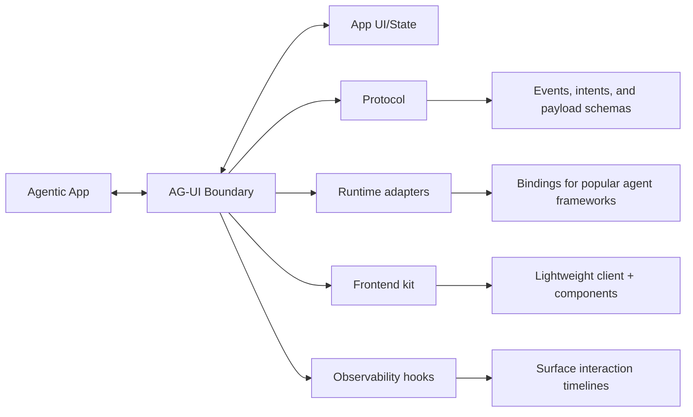

# The Agent–User Interaction (AG-UI) Protocol

*A horizontal standard to bring AI agents into user‑facing frontend applications.*

AG‑UI is the boundary layer where AI agents and users meet. It standardizes how agent state, UI intents, and user interactions flow between your model/agent runtime and your app's frontend—so you can ship reliable, debuggable, user‑friendly agentic features fast.

  

---

## Built with the ecosystem

**First‑party partnerships & integrations**

*AG‑UI works across leading agent frameworks and frontend stacks, with shared vocabulary and primitives that keep your UX consistent as your agents evolve.*

  {/* LangGraph */}
  

    

      <svg width="32" height="32" viewBox="0 0 24 24" fill="white">
        <path d="M22.282 9.821a5.985 5.985 0 0 0-.516-4.91 6.046 6.046 0 0 0-6.51-2.9A6.065 6.065 0 0 0 4.981 4.18a5.985 5.985 0 0 0-3.998 2.9 6.046 6.046 0 0 0 .743 7.097 5.98 5.98 0 0 0 .51 4.911 6.078 6.078 0 0 0 6.518 2.9 5.991 5.991 0 0 0 4.233 2.176c.24.03.48.045.721.045a6.027 6.027 0 0 0 5.721-4.19 6.018 6.018 0 0 0 3.998-2.9 6.044 6.044 0 0 0-.745-7.098z"/>
      </svg>
    

    LangGraph
  

  {/* Mastra */}
  

    

      <svg width="32" height="32" viewBox="0 0 34 34" fill="none" xmlns="http://www.w3.org/2000/svg">
        <circle cx="17" cy="17" r="14" stroke="white" strokeWidth="1.5" />
        <ellipse cx="17" cy="17" rx="14" ry="9.5" transform="rotate(45 17 17)" stroke="white" strokeWidth="1.5" />
        <path d="M11 17h11" stroke="white" strokeWidth="1.5" />
        <path d="M14 20l6-6" stroke="white" strokeWidth="1.5" />
      </svg>
    

    Mastra
  

  {/* CrewAI */}
  

    

      <svg width="32" height="32" viewBox="0 0 24 24" fill="none" stroke="white" strokeWidth="2">
        <path d="M21 16V8a2 2 0 0 0-1-1.73L12 2 4 6.27A2 2 0 0 0 3 8v8a2 2 0 0 0 1 1.73L12 22l8-4.27A2 2 0 0 0 21 16z"/>
        <path d="M7.5 4.21l4.5 2.6 4.5-2.6M12 6.81V17M3.27 6.96L12 12.01l8.73-5.05"/>
      </svg>
    

    CrewAI
  

  {/* ADK */}
  

    

      <svg width="20" height="20" viewBox="0 0 512 512" xmlns="http://www.w3.org/2000/svg">
        <g transform="scale(0.5)" transformOrigin="center">
          <path d="M183.7189483642578,64.85282897949219 C185.0320144742578,64.84567346949219 186.3450805842578,64.83851795949219 187.6979159742578,64.83114582949219 C189.1362702142578,64.82830612949219 190.5746244542578,64.82556432949219 192.0129786942578,64.82296763949219 C193.5414378742578,64.81669465949219 195.0698970542578,64.81004712949219 196.5983562342578,64.80305491949219 C201.6033352442578,64.78209970949219 206.6083142542578,64.77165597949219 211.6133425242578,64.76168833949219 C213.3449170542578,64.75763666949219 215.0764915842578,64.75351962949219 216.8080661142578,64.74933825949219 C224.9516678042578,64.73030010949219 233.0952594742578,64.71607009949219 241.2388791042578,64.70772647949219 C250.5950499342578,64.69797895949219 259.9509826142578,64.67171888949219 269.3070696842578,64.63122558949219 C276.5660327242578,64.60090296949219 283.8249281142578,64.58624215949219 291.0839531642578,64.58294546949219 C295.4060501642578,64.58061206949219 299.7269924142578,64.57187868949219 304.0491206642578,64.54648428949219 C340.2068854142578,64.34503517949219 370.6326164742578,70.37559279949219 397.6865606442578,96.24996977949219 C419.6723151642578,119.06658130949219 427.5924577042578,146.71085217949219 427.2803106442578,177.86715727949219 C426.5439325842578,205.78324884949219 412.8033263142578,231.25422779949219 392.9599981442578,250.37496977949219 C375.3902409242578,265.95132443949219 352.0698621642578,277.05759291949219 328.2801122642578,277.14714079949219 C326.9670461542578,277.15429609949219 325.6539800442578,277.16145139949219 324.3011446542578,277.16882352949219 C322.8627904142578,277.17166322949219 321.4244361742578,277.17437502949219 319.9860819342578,277.17697171949219 C318.4576227542578,277.18324469949219 316.9291635742578,277.18989222949219 315.4007043942578,277.19688443949219 C310.3957253842578,277.21783964949219 305.3907463742578,277.22828337949219 300.3857194042578,277.23825101949219 C298.6541448742578,277.24230268949219 296.9225703442578,277.24641972949219 295.1909958142578,277.25060109949219 C287.0473941242578,277.26963924949219 278.9038024542578,277.28386945949219 270.7601828242578,277.29221307949219 C261.4040119942578,277.30196059949219 252.0480793142578,277.32822066949219 242.6919922442578,277.36871397949219 C235.4330292042578,277.39903658949219 228.1741338142578,277.41369739949219 220.9151087642578,277.41699408949219 C216.5930117642578,277.41932748949219 212.2720695142578,277.42806086949219 207.9499412642578,277.45345526949219 C171.7921765142578,277.65490437949219 141.3664454542578,271.624346949219 114.3125012842578,245.74996977949219 C92.3267467642578,222.93335824949219 84.4066042242578,195.28908737949219 84.7187512842578,164.13278227949219 C85.4551293442578,136.21669070949219 99.1957356142578,110.74571175949219 119.0390637842578,91.62496977949219 C136.6088210042578,76.04861511949219 159.9291997642578,64.94234663949219 183.7189483642578,64.85282897949219 Z" fill="#4285F3" />
          <path d="M216.7889404296875,64.85282897949219 C217.8006178296875,64.84567346949219 218.8122952296875,64.83851795949219 219.8549295296875,64.83114582949219 C220.9695610096875,64.82845692949219 222.0842924896875,64.82576801949219 223.2327419296875,64.82296763949219 C224.4037698696875,64.81639643949219 225.5748978096875,64.80982523949219 226.7814526696875,64.80305491949219 C230.6772251096875,64.78326639949219 234.5731840296875,64.77163512949219 238.4690895996875,64.76168833949219 C239.8152557796875,64.75763890949219 241.1614219596875,64.75352102949219 242.5075881396875,64.74933825949219 C248.8465024796875,64.73026323949219 255.1854251696875,64.71604909949219 261.5243427096875,64.70772647949219 C268.8034267496875,64.69800924949219 276.0822021496875,64.67184591949219 283.3610176096875,64.63122558949219 C289.0063055296875,64.60082433949219 294.6515064096875,64.58623425949219 300.2969940496875,64.58294546949219 C303.6579359296875,64.58061786949219 307.0182909696875,64.57032239949219 310.3789211296875,64.54648428949219 C344.3131898596875,64.32475507949219 372.6955384296875,72.34789161949219 397.6875001096875,96.24996977949219 C419.6732546296875,119.06658130949219 427.5934971696875,146.71085217949219 427.2813501096875,177.86715727949219 C426.5449720496875,205.78324884949219 412.8043657796875,231.25422779949219 392.9610376096875,250.37496977949219 C374.0040750596875,267.18114235949219 350.0177491096875,277.30071081949219 324.5625901096875,277.06246977949219 C323.6402658896875,277.05795801949219 322.7179416696875,277.05344625949219 321.7676682296875,277.04879782949219 C319.5117396296875,277.03710905949219 317.2580504296875,277.02072422949219 315.0041101096875,276.99996977949219 C315.5996769696875,276.71895415949219 316.1952438296875,276.43793852949219 316.8088375596875,276.14840727949219 C321.3438962096875,273.77597446949219 325.1075761696875,270.81164805949219 327.0041101096875,265.99996977949219 C327.7126810196875,261.00701655949219 327.5556370096875,257.08332619949219 325.2541101096875,252.56246977949219 C322.1475334596875,249.02442418949219 319.1845369696875,247.05534633949219 315.0041101096875,244.99996977949219 C315.6380065596875,244.92003813949219 316.2719030096875,244.84010649949219 316.9250585096875,244.76805571949219 C333.8748033796875,243.09000361949219 333.8748033796875,243.09000361949219 350.0041101096875,237.99996977949219 C351.0534069896875,237.52946196949219 352.1027038696875,237.05895415949219 353.1836181596875,236.57418852949219 C371.8305426596875,227.38235163949219 384.3890765096875,211.33026658949219 391.0702077296875,191.89840727949219 C396.8221818896875,171.28022071949219 393.4750567296875,150.72579483949219 383.1133343596875,132.23825202949219 C372.0887814896875,115.31355249949219 355.5470732596875,104.06756805949219 335.9806026296875,99.50778227949219 C328.2412846596875,98.18742618949219 320.6388696796875,97.85400023949219 312.7962964696875,97.85812407949219 C311.7123200896875,97.85464964949219 310.6283437096875,97.85117521949219 309.5114145996875,97.84759550949219 C307.1723268496875,97.83970939949219 304.8332391996875,97.83434209949219 302.4941444696875,97.83130484949219 C298.7909751096875,97.82410035949219 295.0877806796875,97.80840719949219 291.3845190096875,97.78996306949219 C280.8610546596875,97.73765778949219 270.3376788296875,97.68947101949219 259.8142946296875,97.67404204949219 C253.3652683896875,97.66396948949219 246.9166760596875,97.63467437949219 240.4677816796875,97.59272223949219 C238.0138189596875,97.58040899949219 235.5598091296875,97.57529159949219 233.1058165396875,97.57752070949219 C229.6782332796875,97.57987983949219 226.2516133196875,97.55774907949219 222.8241602296875,97.53000907949219 C221.8125834696875,97.53660048949219 220.8010067096875,97.54320189949219 219.7587716796875,97.55000334949219 C213.9925301096875,97.47333956949219 210.5456210596875,96.91382039949219 206.0041101096875,92.99996977949219 C201.7018342096875,88.23258296949219 200.6412850896875,84.56249682949219 200.7228601096875,78.28122977949219 C201.3123039796875,73.50018491949219 204.1523180596875,70.75036799949219 207.6291101096875,67.68747977949219 C211.0005826096875,65.29338089949219 212.7104836096875,64.87260336949219 216.7889404296875,64.85282897949219 Z" fill="#34A753" />
        </g>
      </svg>
    

    ADK
  

  {/* Agno */}
  

    

      <svg width="20" height="20" viewBox="0 0 195 75" fill="none" xmlns="http://www.w3.org/2000/svg">
        <path d="M44.9802 0.200195H16.5703V10.1702H38.0442L56.3442 58.8102H68.1658L44.9802 0.200195Z" fill="white" />
        <path d="M29.59 48.8403H0.5V58.8103H29.59V48.8403Z" fill="white" />
        <path fillRule="evenodd" clipRule="evenodd" d="M106.781 57.3271L106.748 57.2946C106.538 62.7046 104.862 66.8535 101.651 69.6754C99.5756 71.5114 96.5827 72.8283 93.2745 73.5576C89.9605 74.288 86.2923 74.4374 82.8361 73.9058C75.9469 72.8462 69.7197 69.0281 69.1124 61.5207L69.0687 60.9803H78.6597L78.725 61.4043C79.2382 64.7375 82.2366 66.4244 85.7803 66.7766C87.5364 66.9511 89.3766 66.7868 91.0038 66.3457C92.6378 65.9028 94.0152 65.1926 94.8845 64.3096L94.8981 64.2958L94.9127 64.2831C95.4723 63.7965 95.9123 63.0704 96.2494 62.1504C96.5856 61.2328 96.8086 60.152 96.9526 58.9907C97.2411 56.6652 97.2058 54.0891 97.1761 51.9777L97.176 51.9732L97.1725 51.7158C94.7704 55.4822 91.6364 57.5831 88.3259 58.402C84.6598 59.3088 80.8264 58.6317 77.5991 56.9885C73.8994 55.2095 71.4248 51.9689 69.8863 48.249C68.3481 44.5298 67.7308 40.2996 67.7608 36.4697C67.7213 29.0048 71.2243 20.2031 78.2871 16.8883C81.4568 15.376 85.3623 14.7771 88.9867 15.6312C92.1761 16.3827 95.1358 18.258 97.1608 21.5917V16.3104H106.781V57.3271Z" fill="white" />
        <path d="M122.38 21.817V16.29H113.24V58.84H122.83V32.77C122.83 31.4259 123.051 30.1528 123.481 28.9482C123.912 27.743 124.51 26.7201 125.264 25.8723L125.272 25.8624C126.034 24.9601 126.941 24.2776 128.028 23.8091L128.036 23.8056L128.044 23.8018C129.13 23.2869 130.356 23.02 131.75 23.02C134.224 23.02 135.948 23.6948 137.019 24.9541L137.027 24.9623C138.12 26.1911 138.761 28.2555 138.86 31.2684V58.84H148.45V29C148.45 24.4884 147.192 21.012 144.594 18.678C142.019 16.364 138.517 15.23 134.16 15.23C131.517 15.23 129.089 15.8709 126.898 17.1784C125.084 18.2196 123.584 20.0156 122.38 21.817Z" fill="white" />
        <path fillRule="evenodd" clipRule="evenodd" d="M189.43 21.9877C186.048 17.7695 180.97 15.0322 174.236 15.2401C167.503 15.0322 162.425 17.7695 159.043 21.9877C155.669 26.1945 153.999 31.8497 154 37.4791C154.001 43.1085 155.672 48.7631 159.045 52.9686C162.428 57.1855 167.505 59.9209 174.236 59.7106C180.967 59.9209 186.044 57.1855 189.427 52.9686C192.801 48.7631 194.472 43.1085 194.473 37.4791C194.473 31.8497 192.803 26.1945 189.43 21.9877Z" fill="white" />
      </svg>
    

    Agno
  

  {/* LlamaIndex */}
  

    

      <svg width="20" height="20" viewBox="0 0 81 80" version="1.1" xmlns="http://www.w3.org/2000/svg">
        <g stroke="none" strokeWidth="1" fill="none" fillRule="evenodd">
          <g transform="translate(8, 8)" fillRule="nonzero">
            <path d="M50.3091,52.6201 C45.1552,54.8952 39.5718,53.963 37.4243,53.2126 C37.4243,53.726 37.4009,55.3218 37.3072,57.597 C37.2135,59.8721 36.4873,61.3099 36.1359,61.7444 C36.1749,63.1664 36.2062,66.271 36.0188,67.3138 C35.8313,68.3566 35.1598,69.2493 34.8474,69.5652 L31.6848,69.5652 C31.9659,68.1433 33.0513,67.2348 33.5589,66.9583 C33.84,64.0195 33.2856,61.4679 32.9733,60.5594 C32.6609,61.6654 31.8956,64.2328 31.3334,65.6548 C30.7711,67.0768 29.9278,68.3803 29.5763,68.8543 L27.2337,68.8543 C27.1165,67.4323 27.8974,66.9583 28.405,66.9583 C28.6393,66.5238 29.2015,65.1571 29.5763,63.1664 C29.9512,61.1756 29.4202,57.439 29.1078,55.8195 L29.1078,50.7241 C25.3595,48.7096 23.9539,46.6952 23.0168,44.4437 C22.2672,42.6425 22.4702,39.9013 22.6654,38.7558 C22.4311,38.3213 21.7481,37.217 21.4941,35.6749 C21.1427,33.5419 21.3379,32.0014 21.4941,31.1719 C21.2598,30.9349 20.7913,29.7263 20.7913,26.7875 C20.7913,23.8488 21.6502,22.3241 22.0797,21.9291 L22.0797,20.6256 C20.4398,20.5071 18.7999,19.7961 17.8629,18.8482 C16.9258,17.9002 17.6286,16.4782 18.2143,16.0042 C18.7999,15.5302 19.3856,15.8857 20.2056,15.6487 C21.0255,15.4117 21.7283,15.1747 22.0797,14.4637 C22.3608,13.895 21.8064,11.5408 21.494,10.4348 C22.8997,10.6244 23.7977,11.8568 24.071,12.4493 L24.071,10.4348 C25.828,11.2643 28.9907,13.2788 30.0449,17.6632 C30.8882,21.1707 31.4895,28.5255 31.6847,31.7645 C36.1749,31.804 41.8755,31.1211 47.0294,32.2384 C51.7148,33.2542 53.8232,35.3194 56.283,35.3194 C58.7428,35.3194 60.1484,33.8974 61.9055,35.0824 C63.6625,36.2674 64.5996,39.5853 64.3653,42.0738 C64.1779,44.0645 62.6473,44.7202 61.9055,44.7992 C60.9684,47.9276 61.9055,50.9216 62.4911,52.0276 L62.4911,56.5305 C62.7645,56.9255 63.3111,58.1421 63.3111,59.8484 C63.3111,61.5548 62.7645,62.6924 62.4911,63.0479 C62.9597,65.7022 62.2959,68.4198 61.9055,69.4468 L58.7428,69.4468 C59.1177,68.4988 59.758,68.2618 60.0313,68.2618 C60.5936,65.3231 60.1875,62.6134 59.9142,61.6259 C58.1337,60.5831 56.9858,58.7425 56.6344,57.9525 C56.6735,58.624 56.5641,60.4883 55.8145,62.5739 C55.0648,64.6595 53.9403,65.8918 53.4718,66.2473 L53.4718,68.7358 L50.3091,68.7358 C50.3091,67.219 51.1681,66.9188 51.5976,66.9583 C52.1443,65.9708 53.4718,64.4699 53.4718,61.5074 C53.4718,59.0077 51.7148,57.834 50.4263,55.5825 C49.8141,54.5128 50.1139,53.1731 50.3091,52.6201 Z" fill="white" />
          </g>
        </g>
      </svg>
    

    Llamaindex
  

  {/* Pydantic AI */}
  

    

      <svg width="20" height="20" viewBox="0 0 139 120" version="1.1" xmlns="http://www.w3.org/2000/svg">
        <g stroke="none" strokeWidth="1" fill="none" fillRule="evenodd">
          <g transform="translate(0, 0.1733)" fill="white" fillRule="nonzero">
            <path d="M137.124,90.38975 L73.371,2.06775 C71.364,-0.68925 66.738,-0.68925 64.751,2.06775 L0.998,90.38975 C0.349072482,91.2935362 0,92.3781241 0,93.49075 C0.00318943775,95.7819584 1.469778,97.814973 3.643,98.54075 L67.397,119.39175 L67.407,119.39175 C68.4772724,119.740719 69.6307276,119.740719 70.701,119.39175 L70.711,119.39175 L134.464,98.54175 C136.077884,98.0193374 137.341287,96.7514677 137.858,95.13575 C138.390392,93.5257019 138.111354,91.7575889 137.109,90.38975 L137.124,90.38975 Z M69.064,14.23875 L94.617,49.64175 L70.721,41.82875 C70.536,41.76875 70.341,41.77875 70.157,41.73475 C69.976359,41.6901364 69.7924394,41.6600405 69.607,41.64475 C69.423,41.61975 69.248,41.54975 69.064,41.54975 C68.879,41.54975 68.709,41.61975 68.524,41.64475 C68.34,41.66475 68.155,41.69475 67.976,41.73475 C67.786,41.76975 67.591,41.76975 67.422,41.82875 L43.67,49.59675 L43.52,49.64675 L69.074,14.23675 L69.064,14.23675 L69.064,14.23875 Z M32.96,64.26475 L60.779,55.16075 L63.749,54.19375 L63.749,107.03175 L13.869,90.71375 L32.959,64.26475 L32.96,64.26475 Z M74.384,107.02175 L74.384,54.19375 L105.172,64.26475 L124.263,90.69875 L74.379,107.02175 L74.384,107.02175 Z" />
          </g>
        </g>
      </svg>
    

    Pydantic AI
  

  {/* AutoGen2 */}
  

    

      <svg xmlns="http://www.w3.org/2000/svg" width="20" height="20" fill="none" viewBox="0 0 90 50">
        <path fill="white" d="M69.285 0h-3.232v3.232h3.232V0Zm-3.232 16.095h-3.21v6.442h3.21v-6.442Zm0-12.863h-3.21v3.21h3.21v-3.21Zm-3.21 9.652h-3.21v3.21h3.21v-3.21Zm0-6.442h-3.21v3.232h3.21V6.442Zm-3.211 3.232H53.19v3.21h6.442v-3.21ZM53.19 6.442H37.095v3.232H53.19V6.442Zm6.442 19.305v-6.42h-3.231v-3.232H33.885v3.232h-3.232v6.42h28.98Zm-9.652-6.42h3.21v3.21h-3.21v-3.21Zm-12.885 0h3.21v3.21h-3.21v-3.21Zm0-9.653h-6.442v3.21h6.442v-3.21Zm-6.442 3.21h-3.21v3.21h3.21v-3.21Zm0-6.442h-3.21v3.232h3.21V6.442Zm-3.211 9.653h-3.21v6.442h3.21v-6.442Zm0-12.863h-3.21v3.21h3.21v-3.21ZM24.232 0H21v3.232h3.232V0Z" />
        <path fill="white" d="M65.867 37.748V34.33H55.615v-3.418h10.252v3.418h3.418v3.417h-3.418Zm-6.834 3.417v-3.417h6.834v3.417h-6.834ZM55.615 48v-6.835h3.418v3.418h10.252V48h-13.67Zm-13.89-13.67v-3.417h10.252v3.418H41.725Zm-3.417 10.253V34.33h3.417v10.252h-3.417Zm10.252 0v-3.418h-3.417v-3.417h6.834v6.835H48.56ZM41.725 48v-3.417h6.835V48h-6.835ZM21 48V34.33h3.417v-3.417h6.835v3.418h3.418V48h-3.418v-6.835h-6.835V48H21Zm3.417-10.252h6.835v-3.28h-6.835v3.28Z" />
      </svg>
    

    AutoGen2
  

---

## Building blocks (today & upcoming)

  
 { e.currentTarget.style.borderColor = '#3b82f6'; e.currentTarget.style.boxShadow = '0 4px 12px rgba(59, 130, 246, 0.15)'; e.currentTarget.querySelector('.content').style.maxHeight = '200px'; e.currentTarget.querySelector('.content').style.opacity = '1'; }} onMouseLeave={(e) => { e.currentTarget.style.borderColor = '#e5e7eb'; e.currentTarget.style.boxShadow = 'none'; e.currentTarget.querySelector('.content').style.maxHeight = '0px'; e.currentTarget.querySelector('.content').style.opacity = '0'; }}>
    

      Streaming chat
    

    

      

        Token‑level and tool‑event streaming for responsive UIs.
      

    

  

  
 { e.currentTarget.style.borderColor = '#3b82f6'; e.currentTarget.style.boxShadow = '0 4px 12px rgba(59, 130, 246, 0.15)'; e.currentTarget.querySelector('.content').style.maxHeight = '200px'; e.currentTarget.querySelector('.content').style.opacity = '1'; }} onMouseLeave={(e) => { e.currentTarget.style.borderColor = '#e5e7eb'; e.currentTarget.style.boxShadow = 'none'; e.currentTarget.querySelector('.content').style.maxHeight = '0px'; e.currentTarget.querySelector('.content').style.opacity = '0'; }}>
    

      Static generative UI
    

    

      

        Render model output into stable, typed components.
      

    

  

  
 { e.currentTarget.style.borderColor = '#3b82f6'; e.currentTarget.style.boxShadow = '0 4px 12px rgba(59, 130, 246, 0.15)'; e.currentTarget.querySelector('.content').style.maxHeight = '200px'; e.currentTarget.querySelector('.content').style.opacity = '1'; }} onMouseLeave={(e) => { e.currentTarget.style.borderColor = '#e5e7eb'; e.currentTarget.style.boxShadow = 'none'; e.currentTarget.querySelector('.content').style.maxHeight = '0px'; e.currentTarget.querySelector('.content').style.opacity = '0'; }}>
    

      Declarative generative UI
    

    

      

        Let agents propose UI trees; app decides what to mount.
      

    

  

  
 { e.currentTarget.style.borderColor = '#3b82f6'; e.currentTarget.style.boxShadow = '0 4px 12px rgba(59, 130, 246, 0.15)'; e.currentTarget.querySelector('.content').style.maxHeight = '200px'; e.currentTarget.querySelector('.content').style.opacity = '1'; }} onMouseLeave={(e) => { e.currentTarget.style.borderColor = '#e5e7eb'; e.currentTarget.style.boxShadow = 'none'; e.currentTarget.querySelector('.content').style.maxHeight = '0px'; e.currentTarget.querySelector('.content').style.opacity = '0'; }}>
    

      Frontend tools
    

    

      

        Safe, typed tool calls that bridge agent logic to app actions.
      

    

  

  
 { e.currentTarget.style.borderColor = '#3b82f6'; e.currentTarget.style.boxShadow = '0 4px 12px rgba(59, 130, 246, 0.15)'; e.currentTarget.querySelector('.content').style.maxHeight = '200px'; e.currentTarget.querySelector('.content').style.opacity = '1'; }} onMouseLeave={(e) => { e.currentTarget.style.borderColor = '#e5e7eb'; e.currentTarget.style.boxShadow = 'none'; e.currentTarget.querySelector('.content').style.maxHeight = '0px'; e.currentTarget.querySelector('.content').style.opacity = '0'; }}>
    

      Interrupts & human‑in‑the‑loop
    

    

      

        Pause, approve, edit, or steer mid‑flow.
      

    

  

  
 { e.currentTarget.style.borderColor = '#3b82f6'; e.currentTarget.style.boxShadow = '0 4px 12px rgba(59, 130, 246, 0.15)'; e.currentTarget.querySelector('.content').style.maxHeight = '200px'; e.currentTarget.querySelector('.content').style.opacity = '1'; }} onMouseLeave={(e) => { e.currentTarget.style.borderColor = '#e5e7eb'; e.currentTarget.style.boxShadow = 'none'; e.currentTarget.querySelector('.content').style.maxHeight = '0px'; e.currentTarget.querySelector('.content').style.opacity = '0'; }}>
    

      In‑chat + in‑app interactions
    

    

      

        Chat commands alongside regular app controls.
      

    

  

  
 { e.currentTarget.style.borderColor = '#3b82f6'; e.currentTarget.style.boxShadow = '0 4px 12px rgba(59, 130, 246, 0.15)'; e.currentTarget.querySelector('.content').style.maxHeight = '200px'; e.currentTarget.querySelector('.content').style.opacity = '1'; }} onMouseLeave={(e) => { e.currentTarget.style.borderColor = '#e5e7eb'; e.currentTarget.style.boxShadow = 'none'; e.currentTarget.querySelector('.content').style.maxHeight = '0px'; e.currentTarget.querySelector('.content').style.opacity = '0'; }}>
    

      Attachments & multimodality
    

    

      

        Files, images, audio, and structured payloads.
      

    

  

  
 { e.currentTarget.style.borderColor = '#3b82f6'; e.currentTarget.style.boxShadow = '0 4px 12px rgba(59, 130, 246, 0.15)'; e.currentTarget.querySelector('.content').style.maxHeight = '200px'; e.currentTarget.querySelector('.content').style.opacity = '1'; }} onMouseLeave={(e) => { e.currentTarget.style.borderColor = '#e5e7eb'; e.currentTarget.style.boxShadow = 'none'; e.currentTarget.querySelector('.content').style.maxHeight = '0px'; e.currentTarget.querySelector('.content').style.opacity = '0'; }}>
    

      Thinking steps
    

    

      

        Expose summaries/redactions of chain‑of‑thought artifacts to users, safely.
      

    

  

  
 { e.currentTarget.style.borderColor = '#3b82f6'; e.currentTarget.style.boxShadow = '0 4px 12px rgba(59, 130, 246, 0.15)'; e.currentTarget.querySelector('.content').style.maxHeight = '200px'; e.currentTarget.querySelector('.content').style.opacity = '1'; }} onMouseLeave={(e) => { e.currentTarget.style.borderColor = '#e5e7eb'; e.currentTarget.style.boxShadow = 'none'; e.currentTarget.querySelector('.content').style.maxHeight = '0px'; e.currentTarget.querySelector('.content').style.opacity = '0'; }}>
    

      Sub‑agent calls
    

    

      

        Orchestrate nested agents and delegate specialized tasks.
      

    

  

  
 { e.currentTarget.style.borderColor = '#3b82f6'; e.currentTarget.style.boxShadow = '0 4px 12px rgba(59, 130, 246, 0.15)'; e.currentTarget.querySelector('.content').style.maxHeight = '200px'; e.currentTarget.querySelector('.content').style.opacity = '1'; }} onMouseLeave={(e) => { e.currentTarget.style.borderColor = '#e5e7eb'; e.currentTarget.style.boxShadow = 'none'; e.currentTarget.querySelector('.content').style.maxHeight = '0px'; e.currentTarget.querySelector('.content').style.opacity = '0'; }}>
    

      Agent steering
    

    

      

        Guardrails, policies, and UX affordances to keep agents on track.
      

    

  

---

## Design patterns

<Steps>
  <Step title="Explore reusable interaction patterns">
    Discover proven UX patterns for agentic applications
  </Step>
  <Step title="AI‑UI Design Patterns">
    Access our comprehensive pattern library *(coming soon)*
  </Step>
</Steps>

---

## Why AG‑UI

**Agentic apps break the classic request/response contract.** Agents run for longer, stream work as they go, and make nondeterministic choices that can affect your UI and state. AG‑UI defines a clean, observable boundary so frontends remain predictable while agents stay flexible.

### What's hard about user‑facing agents

- Agents are **long‑running** and **stream** intermediate work—often across multi‑turn sessions.
- Agents are **nondeterministic** and can **control UI** in ways that must be supervised.
- Apps must mix **structured + unstructured IO** (text, voice, tool calls, state updates).
- Agents need **composition**: agents **call sub‑agents**, often non-deterministically.

With AG‑UI, these become deliberate, well‑typed interactions rather than ad‑hoc wiring.

---

## Supported Frameworks

AG-UI was born from an initial partnership between CopilotKit, LangGraph and CrewAI - and is steadily gaining integrations within the wider agentic app developer ecosystem.

| Framework | Docs | Demos |
| :----------------------- | :--- | :---- |
| [LangGraph](https://www.langchain.com/langgraph) | [Documentation](https://docs.copilotkit.ai/langgraph/) | [Live Demo](https://dojo.ag-ui.com/langgraph-fastapi/feature/shared_state) |
| [CrewAI](https://crewai.com/) | [Documentation](https://docs.copilotkit.ai/crewai-flows) | [Live Demo](https://dojo.ag-ui.com/crewai/feature/shared_state) |
| [Mastra](https://mastra.ai/) | [Documentation](https://docs.copilotkit.ai/mastra/) | [Live Demo](https://dojo.ag-ui.com/mastra/feature/shared_state) |
| [AG2](https://ag2.ai/) | [Documentation](https://docs.copilotkit.ai/ag2/) | [Live Demo](https://dojo.ag-ui.com/ag2/feature/shared_state) |
| [Agno](https://github.com/agno-agi/agno) | [Documentation](https://docs.copilotkit.ai/agno/) | [Live Demo](https://dojo.ag-ui.com/agno/feature/shared_state) |
| [LlamaIndex](https://github.com/run-llama/llama_index) | [Documentation](https://docs.copilotkit.ai/llamaindex/) | [Live Demo](https://dojo.ag-ui.com/llamaindex/feature/shared_state) |
| [Pydantic AI](https://github.com/pydantic/pydantic-ai) | [Documentation](https://docs.copilotkit.ai/pydantic-ai/) | [Live Demo](https://dojo.ag-ui.com/pydantic-ai/feature/shared_state) |
| [Google ADK](https://google.github.io/adk-docs/get-started/) | [PR #274](https://github.com/ag-ui-protocol/ag-ui/pull/274) | Coming Soon |
| [AWS Bedrock Agents](https://aws.amazon.com/bedrock/agents/) | In Progress | Coming Soon |
| [AWS Strands Agents](https://github.com/strands-agents/sdk-python) | In Progress | Coming Soon |
| [Vercel AI SDK](https://github.com/vercel/ai) | In Progress | Coming Soon |
| [OpenAI Agent SDK](https://openai.github.io/openai-agents-python/) | In Progress | Coming Soon |
| [Cloudflare Agents](https://developers.cloudflare.com/agents/) | Open to Contributions | Coming Soon |

---

## Quick links

- **[Get started](/quickstart/applications)** 
- **[Concepts](/concepts/architecture)/** 

---

## How AG‑UI fits

- **Protocol**: Events, intents, and payload schemas shared by agents & apps.
- **Runtime adapters**: Bindings for popular agent frameworks.
- **Frontend kit**: Lightweight client + components to handle streaming & interrupts.
- **Observability hooks**: Surface interaction timelines for debugging & learning.
