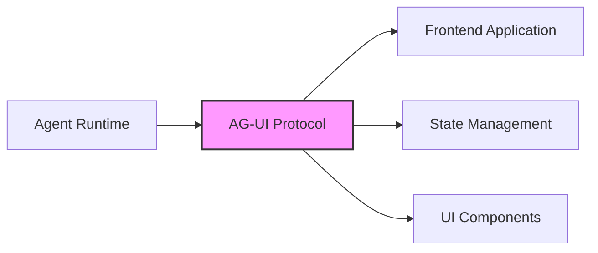

# AG‑UI: The Agent–User Interaction Protocol

*A horizontal standard to bring AI agents into user‑facing frontend applications.*

AG‑UI is the boundary layer where agents and users meet. It standardizes how agent state, UI intents, and user interactions flow between your model/agent runtime and your app's frontend—so you can ship reliable, debuggable, user‑friendly agentic features fast.

---

## Built with the ecosystem

**First‑party partnerships & integrations**

<CardGroup cols={4}>
  <Card title="LangGraph" icon="link" />
  <Card title="CrewAI" icon="users" />
  <Card title="Autogen 2" icon="robot" />
  <Card title="LlamaIndex" icon="search" />
  <Card title="Mastra" icon="code" />
  <Card title="Pydantic AI" icon="python" />
  <Card title="Vercel AI SDK" icon="triangle" />
  <Card title="Next.js" icon="nextjs" />
</CardGroup>

*AG‑UI works across leading agent frameworks and frontend stacks, with shared vocabulary and primitives that keep your UX consistent as your agents evolve.*

---

## Building blocks (today & upcoming)

<CardGroup cols={2}>
  <Card title="Streaming chat" icon="message-lines">
    Token‑level and tool‑event streaming for responsive UIs.
  </Card>
  <Card title="Static generative UI" icon="layout">
    Render model output into stable, typed components.
  </Card>
  <Card title="Declarative generative UI" icon="tree">
    Let agents propose UI trees; app decides what to mount.
  </Card>
  <Card title="Frontend tools" icon="wrench">
    Safe, typed tool calls that bridge agent logic to app actions.
  </Card>
  <Card title="Interrupts & human‑in‑the‑loop" icon="hand">
    Pause, approve, edit, or steer mid‑flow.
  </Card>
  <Card title="In‑chat + in‑app interactions" icon="chat">
    Chat commands alongside regular app controls.
  </Card>
  <Card title="Attachments & multimodality" icon="paperclip">
    Files, images, audio, and structured payloads.
  </Card>
  <Card title="Thinking steps" icon="brain">
    Expose summaries/redactions of chain‑of‑thought artifacts to users, safely.
  </Card>
  <Card title="Sub‑agent calls" icon="sitemap">
    Orchestrate nested agents and delegate specialized tasks.
  </Card>
  <Card title="Agent steering" icon="steering-wheel">
    Guardrails, policies, and UX affordances to keep agents on track.
  </Card>
</CardGroup>

<Card title="See the full capability map" icon="arrow-right" href="/concepts/architecture">
  Explore detailed documentation on all AG-UI capabilities
</Card>

---

## Design patterns

Explore reusable interaction patterns for agentic UX:

<Card title="AI-UI Design Patterns" icon="palette" href="/patterns">
  Discover proven patterns for building intuitive agent interfaces
</Card>

---

## Why AG‑UI

**Agentic apps break the classic request/response contract.** Agents run for longer, stream work as they go, and make nondeterministic choices that can affect your UI and state. AG‑UI defines a clean, observable boundary so frontends remain predictable while agents stay flexible.

### What's hard about user‑facing agents

<AccordionGroup>
  <Accordion title="Long-running and streaming operations">
    Agents are **long‑running** and **stream** intermediate work—often across multi‑turn sessions.
  </Accordion>
  <Accordion title="Nondeterministic UI control">
    Agents are **nondeterministic** and can **control UI** in ways that must be supervised.
  </Accordion>
  <Accordion title="Mixed IO requirements">
    Apps must mix **structured + unstructured IO** (text, voice, tool calls, state updates).
  </Accordion>
  <Accordion title="Agent composition">
    Agents need **composition**: agents **call sub‑agents**, often non-deterministically.
  </Accordion>
</AccordionGroup>

With AG‑UI, these become deliberate, well‑typed interactions rather than ad‑hoc wiring.

---

## Framework Support & Demos

| Framework / Platform    | What works today                       | Documentation | Demo |
| ----------------------- | -------------------------------------- | ------------- | ---- |
| LangGraph               | Streams, tools, interrupts, sub‑agents | [Docs](/integrations/langgraph) | [Demo](#) |
| CrewAI                  | Tools, action routing, steering        | [Docs](/integrations/crewai) | [Demo](#) |
| Autogen 2               | Multi‑agent orchestration, messaging   | [Docs](/integrations/ag2) | [Demo](#) |
| LlamaIndex              | Query/agent routing, UI intents        | [Docs](/integrations/llamaindex) | [Demo](#) |
| OpenAI Realtime         | Live stream, events, attachments       | [Docs](#) | [Demo](#) |
| Vercel AI SDK / Next.js | Edge streaming, SSR hydration          | [Docs](/integrations/vercel-ai-sdk) | [Demo](#) |

---

## Quick links

<CardGroup cols={2}>
  <Card title="Get Started" icon="rocket" href="/quickstart/introduction">
    Jump into building your first AG-UI application
  </Card>
  <Card title="Core Concepts" icon="book" href="/concepts/architecture">
    Understand the agent-UI boundary and key principles
  </Card>
  <Card title="API Reference" icon="code" href="/sdk/js/overview">
    Explore the complete SDK documentation
  </Card>
  <Card title="Design Patterns" icon="palette" href="/patterns">
    Learn proven patterns for agentic UX
  </Card>
</CardGroup>

---

## How AG‑UI fits

AG-UI provides a complete solution for agent-user interaction:

<Steps>
  <Step title="Protocol">
    Events, intents, and payload schemas shared by agents & apps.
  </Step>
  <Step title="Runtime adapters">
    Bindings for popular agent frameworks.
  </Step>
  <Step title="Frontend kit">
    Lightweight client + components to handle streaming & interrupts.
  </Step>
  <Step title="Observability hooks">
    Surface interaction timelines for debugging & learning.
  </Step>
</Steps>

*Agent(s) ⇄ AG‑UI Boundary ⇄ App UI/State*
