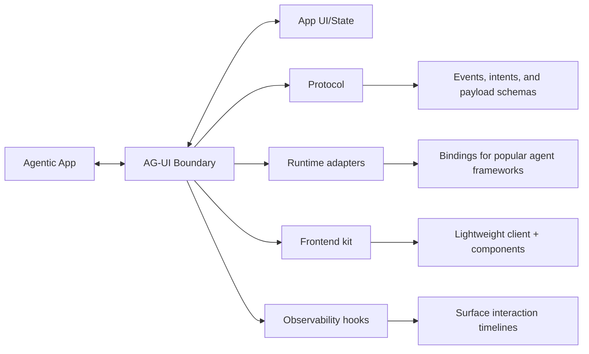

# The Agent–User Interaction (AG-UI) Protocol

*A horizontal standard to bring AI agents into user‑facing frontend applications.*

AG‑UI is the boundary layer where AI agents and users meet. It standardizes how agent state, UI intents, and user interactions flow between your model/agent runtime and your app's frontend—so you can ship reliable, debuggable, user‑friendly agentic features fast.

---

## Built with the ecosystem

**First‑party partnerships & integrations**

*AG‑UI works across leading agent frameworks and frontend stacks, with shared vocabulary and primitives that keep your UX consistent as your agents evolve.*

  

---

## Building blocks (today & upcoming)

  
 { e.currentTarget.style.borderColor = '#3b82f6'; e.currentTarget.style.boxShadow = '0 4px 12px rgba(59, 130, 246, 0.15)'; e.currentTarget.querySelector('.content').style.maxHeight = '200px'; e.currentTarget.querySelector('.content').style.opacity = '1'; }} onMouseLeave={(e) => { e.currentTarget.style.borderColor = '#e5e7eb'; e.currentTarget.style.boxShadow = 'none'; e.currentTarget.querySelector('.content').style.maxHeight = '0px'; e.currentTarget.querySelector('.content').style.opacity = '0'; }}>
    

      Streaming chat
    

    

      

        Token‑level and tool‑event streaming for responsive UIs.
      

    

  

  
 { e.currentTarget.style.borderColor = '#3b82f6'; e.currentTarget.style.boxShadow = '0 4px 12px rgba(59, 130, 246, 0.15)'; e.currentTarget.querySelector('.content').style.maxHeight = '200px'; e.currentTarget.querySelector('.content').style.opacity = '1'; }} onMouseLeave={(e) => { e.currentTarget.style.borderColor = '#e5e7eb'; e.currentTarget.style.boxShadow = 'none'; e.currentTarget.querySelector('.content').style.maxHeight = '0px'; e.currentTarget.querySelector('.content').style.opacity = '0'; }}>
    

      Static generative UI
    

    

      

        Render model output into stable, typed components.
      

    

  

  
 { e.currentTarget.style.borderColor = '#3b82f6'; e.currentTarget.style.boxShadow = '0 4px 12px rgba(59, 130, 246, 0.15)'; e.currentTarget.querySelector('.content').style.maxHeight = '200px'; e.currentTarget.querySelector('.content').style.opacity = '1'; }} onMouseLeave={(e) => { e.currentTarget.style.borderColor = '#e5e7eb'; e.currentTarget.style.boxShadow = 'none'; e.currentTarget.querySelector('.content').style.maxHeight = '0px'; e.currentTarget.querySelector('.content').style.opacity = '0'; }}>
    

      Declarative generative UI
    

    

      

        Let agents propose UI trees; app decides what to mount.
      

    

  

  
 { e.currentTarget.style.borderColor = '#3b82f6'; e.currentTarget.style.boxShadow = '0 4px 12px rgba(59, 130, 246, 0.15)'; e.currentTarget.querySelector('.content').style.maxHeight = '200px'; e.currentTarget.querySelector('.content').style.opacity = '1'; }} onMouseLeave={(e) => { e.currentTarget.style.borderColor = '#e5e7eb'; e.currentTarget.style.boxShadow = 'none'; e.currentTarget.querySelector('.content').style.maxHeight = '0px'; e.currentTarget.querySelector('.content').style.opacity = '0'; }}>
    

      Frontend tools
    

    

      

        Safe, typed tool calls that bridge agent logic to app actions.
      

    

  

  
 { e.currentTarget.style.borderColor = '#3b82f6'; e.currentTarget.style.boxShadow = '0 4px 12px rgba(59, 130, 246, 0.15)'; e.currentTarget.querySelector('.content').style.maxHeight = '200px'; e.currentTarget.querySelector('.content').style.opacity = '1'; }} onMouseLeave={(e) => { e.currentTarget.style.borderColor = '#e5e7eb'; e.currentTarget.style.boxShadow = 'none'; e.currentTarget.querySelector('.content').style.maxHeight = '0px'; e.currentTarget.querySelector('.content').style.opacity = '0'; }}>
    

      Interrupts & human‑in‑the‑loop
    

    

      

        Pause, approve, edit, or steer mid‑flow.
      

    

  

  
 { e.currentTarget.style.borderColor = '#3b82f6'; e.currentTarget.style.boxShadow = '0 4px 12px rgba(59, 130, 246, 0.15)'; e.currentTarget.querySelector('.content').style.maxHeight = '200px'; e.currentTarget.querySelector('.content').style.opacity = '1'; }} onMouseLeave={(e) => { e.currentTarget.style.borderColor = '#e5e7eb'; e.currentTarget.style.boxShadow = 'none'; e.currentTarget.querySelector('.content').style.maxHeight = '0px'; e.currentTarget.querySelector('.content').style.opacity = '0'; }}>
    

      In‑chat + in‑app interactions
    

    

      

        Chat commands alongside regular app controls.
      

    

  

  
 { e.currentTarget.style.borderColor = '#3b82f6'; e.currentTarget.style.boxShadow = '0 4px 12px rgba(59, 130, 246, 0.15)'; e.currentTarget.querySelector('.content').style.maxHeight = '200px'; e.currentTarget.querySelector('.content').style.opacity = '1'; }} onMouseLeave={(e) => { e.currentTarget.style.borderColor = '#e5e7eb'; e.currentTarget.style.boxShadow = 'none'; e.currentTarget.querySelector('.content').style.maxHeight = '0px'; e.currentTarget.querySelector('.content').style.opacity = '0'; }}>
    

      Attachments & multimodality
    

    

      

        Files, images, audio, and structured payloads.
      

    

  

  
 { e.currentTarget.style.borderColor = '#3b82f6'; e.currentTarget.style.boxShadow = '0 4px 12px rgba(59, 130, 246, 0.15)'; e.currentTarget.querySelector('.content').style.maxHeight = '200px'; e.currentTarget.querySelector('.content').style.opacity = '1'; }} onMouseLeave={(e) => { e.currentTarget.style.borderColor = '#e5e7eb'; e.currentTarget.style.boxShadow = 'none'; e.currentTarget.querySelector('.content').style.maxHeight = '0px'; e.currentTarget.querySelector('.content').style.opacity = '0'; }}>
    

      Thinking steps
    

    

      

        Expose summaries/redactions of chain‑of‑thought artifacts to users, safely.
      

    

  

  
 { e.currentTarget.style.borderColor = '#3b82f6'; e.currentTarget.style.boxShadow = '0 4px 12px rgba(59, 130, 246, 0.15)'; e.currentTarget.querySelector('.content').style.maxHeight = '200px'; e.currentTarget.querySelector('.content').style.opacity = '1'; }} onMouseLeave={(e) => { e.currentTarget.style.borderColor = '#e5e7eb'; e.currentTarget.style.boxShadow = 'none'; e.currentTarget.querySelector('.content').style.maxHeight = '0px'; e.currentTarget.querySelector('.content').style.opacity = '0'; }}>
    

      Sub‑agent calls
    

    

      

        Orchestrate nested agents and delegate specialized tasks.
      

    

  

  
 { e.currentTarget.style.borderColor = '#3b82f6'; e.currentTarget.style.boxShadow = '0 4px 12px rgba(59, 130, 246, 0.15)'; e.currentTarget.querySelector('.content').style.maxHeight = '200px'; e.currentTarget.querySelector('.content').style.opacity = '1'; }} onMouseLeave={(e) => { e.currentTarget.style.borderColor = '#e5e7eb'; e.currentTarget.style.boxShadow = 'none'; e.currentTarget.querySelector('.content').style.maxHeight = '0px'; e.currentTarget.querySelector('.content').style.opacity = '0'; }}>
    

      Agent steering
    

    

      

        Guardrails, policies, and UX affordances to keep agents on track.
      

    

  

## AG-UI in action

  <video 
    width="100%" 
    height="auto" 
    autoPlay 
    muted 
    loop 
    controls 
    style={{maxWidth: '800px', borderRadius: '12px', boxShadow: '0 8px 32px rgba(0, 0, 0, 0.12)'}}
  >
    <source src="/videos/Dojo-overview.mp4" type="video/mp4" />
    Your browser does not support the video tag.
  </video>

<Callout type="info" icon="lightbulb">
You can see demo apps of the AG-UI features with the framework of your choice, with preview, code and walkthrough docs in the [AG-UI Dojo](dojo.ag-ui.com)
</Callout>

---

## AG-UI Design patterns

<Steps>
  <Step title="Explore reusable interaction patterns">
    Discover proven UX patterns for agentic applications
  </Step>
  <Step title="AI‑UI Design Patterns">
    Access our comprehensive pattern library *(coming soon)*
  </Step>
</Steps>

---
## Why Agentic Apps need AG-UI

**Agentic apps break the classic request/response contract.** Agents run for longer, stream work as they go, and make nondeterministic choices that can affect your UI and state. AG‑UI defines a clean, observable boundary so frontends remain predictable while agents stay flexible.

### What's hard about user‑facing agents?

- Agents are **long‑running** and **stream** intermediate work—often across multi‑turn sessions.
- Agents are **nondeterministic** and can **control UI** in ways that must be supervised.
- Apps must mix **structured + unstructured IO** (text, voice, tool calls, state updates).
- Agents need **composition**: agents **call sub‑agents**, often non-deterministically.

With AG‑UI, these become deliberate, well‑typed interactions rather than ad‑hoc wiring.

---

## Supported Frameworks

AG-UI was born from an initial partnership between CopilotKit, LangGraph and CrewAI - and is steadily gaining integrations across the wider AI developer ecosystem.

| Framework | Docs | Demos |
| :----------------------- | :--- | :---- |
| [LangGraph](https://www.langchain.com/langgraph) | [Documentation](https://docs.copilotkit.ai/langgraph/) | [Live Demo](https://dojo.ag-ui.com/langgraph-fastapi/feature/shared_state) |
| [CrewAI](https://crewai.com/) | [Documentation](https://docs.copilotkit.ai/crewai-flows) | [Live Demo](https://dojo.ag-ui.com/crewai/feature/shared_state) |
| [Mastra](https://mastra.ai/) | [Documentation](https://docs.copilotkit.ai/mastra/) | [Live Demo](https://dojo.ag-ui.com/mastra/feature/shared_state) |
| [AG2](https://ag2.ai/) | [Documentation](https://docs.copilotkit.ai/ag2/) | [Live Demo](https://dojo.ag-ui.com/ag2/feature/shared_state) |
| [Agno](https://github.com/agno-agi/agno) | [Documentation](https://docs.copilotkit.ai/agno/) | [Live Demo](https://dojo.ag-ui.com/agno/feature/shared_state) |
| [LlamaIndex](https://github.com/run-llama/llama_index) | [Documentation](https://docs.copilotkit.ai/llamaindex/) | [Live Demo](https://dojo.ag-ui.com/llamaindex/feature/shared_state) |
| [Pydantic AI](https://github.com/pydantic/pydantic-ai) | [Documentation](https://docs.copilotkit.ai/pydantic-ai/) | [Live Demo](https://dojo.ag-ui.com/pydantic-ai/feature/shared_state) |
| [Google ADK](https://google.github.io/adk-docs/get-started/) | [PR #274](https://github.com/ag-ui-protocol/ag-ui/pull/274) | Coming Soon |
| [AWS Bedrock Agents](https://aws.amazon.com/bedrock/agents/) | In Progress | Coming Soon |
| [AWS Strands Agents](https://github.com/strands-agents/sdk-python) | In Progress | Coming Soon |
| [Vercel AI SDK](https://github.com/vercel/ai) | In Progress | Coming Soon |
| [OpenAI Agent SDK](https://openai.github.io/openai-agents-python/) | In Progress | Coming Soon |
| [Cloudflare Agents](https://developers.cloudflare.com/agents/) | Open to Contributions | Coming Soon |

---

## Quick links

- **[Get started](/quickstart/applications)** 
- **[Concepts](/concepts/architecture)/** 

---

## How AG‑UI fits

- **Protocol**: Events, intents, and payload schemas shared by agents & apps.
- **Runtime adapters**: Bindings for popular agent frameworks.
- **Frontend kit**: Lightweight client + components to handle streaming & interrupts.
- **Observability hooks**: Surface interaction timelines for debugging & learning.
